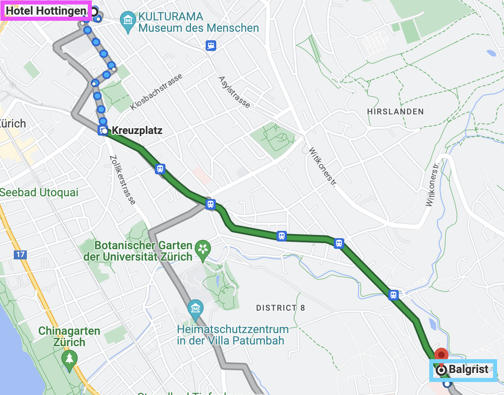
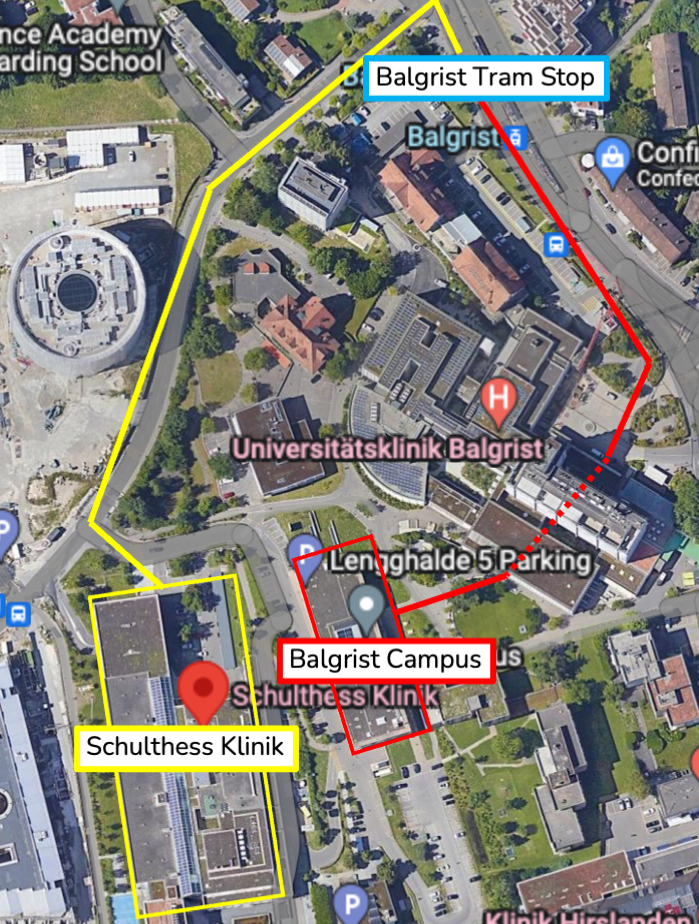

# Sharing and Curating Open Data in Musculoskeletal Imaging Research
## 2nd workshop of the [Open and Reproducible Musculoskeletal Imaging Research (ORMIR) Community](https://ormircommunity.github.io/)
Main financial support by [Swiss National Science Foundation (SNSF)](https://www.snf.ch/en)   
Sponsors: [Balgrist Campus](https://www.balgristcampus.ch/), [Schulthess Klinik](https://www.schulthess-klinik.ch/en), [Google Cloud](https://cloud.google.com/?hl=en), [Zurich Tourism Office](https://www.zuerich.com/en)
  

Dates: January 15-18, 2024

Venues in Zurich (Switzerland): 
- [Balgrist Campus](https://www.balgristcampus.ch/), [Lengghalde 5](https://goo.gl/maps/K64WFruSgq6ZTmJt6) 
- [Schulthess Klinik](https://www.schulthess-klinik.ch/en), [Lengghalde 2](https://goo.gl/maps/ospjThjCGCZfmseAA) 
- [Google Cloud](https://cloud.google.com/blog/products/infrastructure/new-gcp-region-in-zurich-growing-our-support-for-swiss-and-european-businesses), [Europaallee 20](https://goo.gl/maps/qTqdNqWavkzfH8eHA) 

---

In this page, you will find (work in progress!): 

- [Program](#Program)  
  <!-- - [Hackathons](#hackathons), [Tutorials](#tutorials), [Invited speakers](#invited-speakers), [Walk/hike](#walkhike), [Other material](#other-material)   --> 
- [Participants](#participants)  
- [Staying, eating, and travelling](#stayingeatingtravelling)    
  - [Accommodation](#accommodation), [Meals](#meals), [Public Transportation](#public-transportation), [Travel reimbursements](#travel-reimbursements)  
- [Tips](#tips)   
  - [What you need to know about Switzerland](#What-you-need-to-know-about-the-Switzerland), [Practical information about Zurich](#Practical-information-about-Zurich), [Things to do or see in Zurich](#Things-to-do-or-see-in-Zurich)     
- [More](#more)   
  - [Accepted proposal](#accepted-proposal), [Final budget](#final-budget), [Photos](#photos), [Final report](#final-report), [Code for badges](#code-for-badges)

---

---

## Staying, eating, and travelling

### Accommodation
- Where: [Hotel Hottingen](https://www.hotelhottingen.ch/en/), Hottingerstrasse 31, 8032 Zurich, Switzerland
- Check in: Monday, January 15, 2024
- Check out: Thursday, January 18, 2024 
- Number of nights: 3

### Public transportation
- Public transportation in Switzerland is very reliable. You can plan your trips at [sbb.ch](https://www.sbb.ch/en/home.html) or you can download and install the [SBB app](https://www.sbb.ch/en/timetable/mobile-apps/sbb-mobile.html)
- You will have to pay yourself the trip from the airport to the hotel (about 3.50CHF)
- At the hotel, you will find the Zurich Card, which is a 72 hour ticket that you can use for any transportation in Zurich (including trip back to the airport) and fantastic [benefits](https://www.zuerich.com/en). Don't forget to print it the first time you use it and to always keep it with you!
- Reaching Balgrist Campus and Schulthess Klinik: Take tram 11 or S18 (left map) and get off at the stop stop *Balgrist*. Then:
  - To Balgrist Campus (red path on right map) : Walk to the Balgrist *Hospital* main entrance, walk through the main building hall, and exit to the other side. Balgrist *Campus* will be in front of you!
  - To Schulthess Clinic (yellow path on right map): Walk the downhill street until the Klinik!
   
- Reaching Google (coming soon!):

