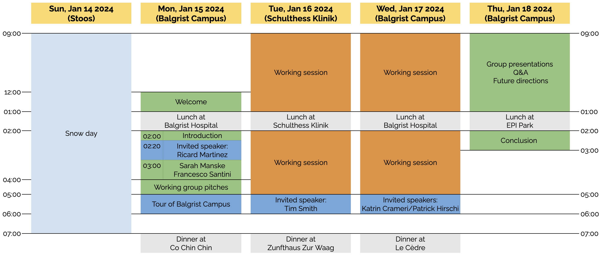

# Sharing and Curating Open Data in Musculoskeletal Imaging Research
## 2nd workshop of the [Open and Reproducible Musculoskeletal Imaging Research (ORMIR) Community](https://ormircommunity.github.io/)
Main financial support by the [Swiss National Science Foundation (SNSF)](https://www.snf.ch/en)   
Sponsors: [Balgrist Campus](https://www.balgristcampus.ch/), [Schulthess Klinik](https://www.schulthess-klinik.ch/en), [Google Cloud](https://cloud.google.com/?hl=en), [Zurich Tourism Office](https://www.zuerich.com/en)
  

Dates: January 15-18, 2024

Venues in Zurich (Switzerland): 
- [Balgrist Campus](https://www.balgristcampus.ch/), [Lengghalde 5](https://goo.gl/maps/K64WFruSgq6ZTmJt6) 
- [Schulthess Klinik](https://www.schulthess-klinik.ch/en), [Lengghalde 2](https://goo.gl/maps/ospjThjCGCZfmseAA) 
- [Google Cloud](https://cloud.google.com/?hl=en), [Europaallee 20](https://goo.gl/maps/qTqdNqWavkzfH8eHA) 

---

In this page, you will find (work in progress!): 

- [Program](#Program)  
  <!-- - [Hackathons](#hackathons), [Tutorials](#tutorials), [Invited speakers](#invited-speakers), [Walk/hike](#walkhike), [Other material](#other-material)   --> 
- [Participants](#participants)  
- [Staying, eating, and travelling](#stayingeatingtravelling)    
  - [Accommodation](#accommodation), [Meals](#meals), [Public Transportation](#public-transportation), [Travel reimbursements](#travel-reimbursements)  
- [Tips](#tips)   
  - [What you need to know about Switzerland](#What-you-need-to-know-about-the-Switzerland), [Practical information about Zurich](#Practical-information-about-Zurich), [Things to do or see in Zurich](#Things-to-do-or-see-in-Zurich)     
- [More](#more)   
  - [Accepted proposal](#accepted-proposal), [Final budget](#final-budget), [Photos](#photos), [Final report](#final-report), [Code for badges](#code-for-badges)

---

## Program
Preliminary program:

  

---

## Participants
- [Andrew	Burghardt](https://profiles.ucsf.edu/andrew.burghardt)
- [Andy Kin On Wong](https://www.uhnresearch.ca/researcher/andy-kin-wong)
- [Bryn Matheson](https://www.ucalgary.ca/labs/bonelab/bryn-matheson)
- [Danielle Whittier](https://www.linkedin.com/in/daniellewhittier/)
- [Donnie	Cameron](https://www.spierziektencentrum.nl/person/dr-donnie-cameron/)
- [Egor Panfilov](https://www.linkedin.com/in/egorpanfilov/)
- [Francesco Santini](https://www.francescosantini.com/wp/)
- [Fulvia	Taddei](https://www.ior.it/en/ricerca-e-innovazione/fulvia-taddei-biomedical-engineer)
- [Gianluca	Iori](https://github.com/gianthk)
- [Gianluigi	Crimi](https://www.ior.it/en/ricerca-e-innovazione/gianluigi-crimi)
- [Giulia	Fraterrigo](https://www.ior.it/en/ricerca-e-innovazione/ing-giulia-fraterrigo)
- [Kathryn	Stok](https://biomedical.eng.unimelb.edu.au/integrative-cartilage/people)
- [Lorenzo Grassi](https://portal.research.lu.se/portal/en/persons/lorenzo-grassi(60a050a4-8557-479b-b842-74ecd1827869).html)
- [Martino	Pani](https://www.port.ac.uk/about-us/structure-and-governance/our-people/our-staff/martino-pani)
- [Matthias Walle](https://biomech.ethz.ch/the-institute/people/person-detail.MjQ5NTcw.TGlzdC8yMzMsLTIwMjg3MDE2MzE=.html)
- [Sarah	Manske](https://cumming.ucalgary.ca/departments/radiology/profiles/sarah-manske)
- [Serena Bonaretti](https://sbonaretti.github.io/)
- [Simone Pancioni](https://www.artorg.unibe.ch/research/mb/group_members/staff/poncioni_simone/index_eng.html)
- [Vincent Stadelmann](https://www.schulthess-klinik.ch/de/spezialist/vincent-stadelmann-phd-emba)
- [Youngjun Lee]()  
3 more to be confirmed!

---

## Staying, eating, and travelling

### Accommodation
- Where: [Hotel Hottingen](https://www.hotelhottingen.ch/en/), Hottingerstrasse 31, 8032 Zurich, Switzerland
- Breakfast, WiFi, and City Tax are included
- Check in: Monday, January 15, 2024 from 3pm
- Check out: Thursday, January 18, 2024 until 11am
- Number of nights: 3

### Public transportation
- Public transportation in Switzerland is very reliable. You can plan your trips at [sbb.ch](https://www.sbb.ch/en/home.html) or you can download and install the [SBB app](https://www.sbb.ch/en/timetable/mobile-apps/sbb-mobile.html)
- Convenient vocabulary and abbreviations: Flughafen = airport; Banhof = train station; Hauptbanhof (abbreviated HB) = main train station; Bahnhofplatz (abbreviated Bfpl) = train station square 
- You will have to pay yourself the trip from the airport to the hotel (about 7 CHF)
- At the hotel, you will find the **Zurich Card**, which is a 72 hour ticket that you can use for any transportation in Zurich (including the trip back to the airport) and fantastic [benefits](https://www.zuerich.com/en). Don't forget to print it the first time you use it and to always keep it with you!
- Reaching **Hotel Hottinger** (Hottingerstrasse 31): From the airport (*Zürich Flughafen*), take any train to the main train station (*Zürich HB*). Exit the train station on the right side, and get the tram 3 direction *Zürich, Klusplatz*. Get off at the stop *Hottingerplatz* and walk to the hotel (2 min)
- Reaching **Balgrist Campus** (Lengghalde 5) and **Schulthess Klinik** (Lengghalde 2): From your hotel, walk to the tram stop *Kreuzplatz* (10 min). Take tram 11 direction *Zürich, Rehalp* or tram S18 directions *Forch* or *Esslingen*  and get off at the stop *Balgrist*. Then:
  - To Balgrist Campus (red path on central map) : Walk to the Balgrist *Hospital* main entrance (1 min), walk through the main building hall, and exit to the other side. Balgrist *Campus* will be in front of you!
  - To Schulthess Klinik (yellow path on central map): Walk the downhill street to the Klinik (5 min)
- Reaching **Google Cloud** (Europaallee 20): From your hotel, walk to the tram stop *Hottingerplatz* (3min). Then, take the tram 3 direction *Zurich Albisrieden* (10 min) and get off at *Sihlpost/HB*. Walk to Europaallee 20 (4 minutes).

## More
### Accepted proposal
Find the accepted SNSF grant proposal [here](https://doi.org/10.5281/zenodo.8349119)

