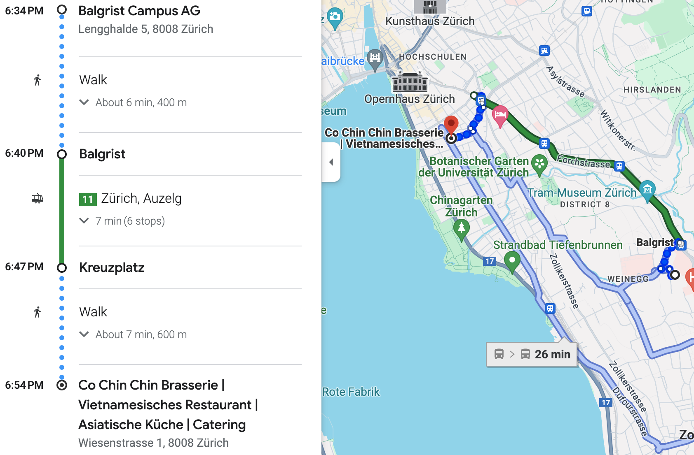

# Sharing and Curating Open Data in Musculoskeletal Imaging Research
## 2nd workshop of the [Open and Reproducible Musculoskeletal Imaging Research (ORMIR) Community](https://ormircommunity.github.io/)
Main financial support by the [Swiss National Science Foundation (SNSF)](https://www.snf.ch/en)   
Sponsors: [Balgrist Campus](https://www.balgristcampus.ch/), [Schulthess Klinik](https://www.schulthess-klinik.ch/en), [Zurich Tourism Office](https://www.zuerich.com/en)
  

Dates: January 15-18, 2024

Venues in Zurich (Switzerland): 
- [Balgrist Campus](https://www.balgristcampus.ch/), [Lengghalde 5](https://goo.gl/maps/K64WFruSgq6ZTmJt6) 
- [Schulthess Klinik](https://www.schulthess-klinik.ch/en), [Lengghalde 2](https://goo.gl/maps/ospjThjCGCZfmseAA) 

---

In this page, you will find (work in progress!): 

- [Program](#Program)
  - [Working groups](#working-groups)
  - [Invited speakers](#invited-speakers)
  - [Day 1: Presentations](#day-1-presentations)
  <!-- - [Hackathons](#hackathons), [Tutorials](#tutorials), , [Walk/hike](#walkhike), [Other material](#other-material)   --> 
- [Participants](#participants)  
- [Staying, eating, and travelling](#stayingeatingtravelling)    
  - [Accommodation](#accommodation), [Meals](#meals), [Public transportation](#public-transportation), [Travel reimbursements](#travel-reimbursements)  
- [More](#more)   
  - [Accepted proposal](#accepted-proposal), <!--[Final budget](#final-budget),-->  [Photos](#photos) <!--[Final report](#final-report)--> 

<!--
- [Tips](#tips)   
  - [What you need to know about Switzerland](#What-you-need-to-know-about-the-Switzerland), [Practical information about Zurich](#Practical-information-about-Zurich), [Things to do or see in Zurich](#Things-to-do-or-see-in-Zurich)   -->

---

## Program

  

### Working groups  

- Metadata standardization for (MSK)BIDS (now ORMIR-MIDS) 
  - Group presentation: [here](./presentations/ormir_mids.pdf)
  - GitHub repository: [coming soon!]()
  - Coordinators: **Gianluca Iori** and **Donnie Cameron**
- Guidelines for data sharing 
  - GitHub repository: [ORMIR data guidelines](https://github.com/ORMIRcommunity/ormir_index_guidelines)
  - Documentation: [document](https://docs.google.com/document/d/1zlM3jXVO-tIVCum4jvh4jGhMstlhguBCqHR1yd-3cm8/edit?usp=sharing) and [spreadsheet](./presentations/Group1-DataSharing-ConsensusMetaDataList-Final.xlsx)
  - Coordinator: **Sarah Manske**
- Biomechanics 
  - Group presentation: [here](./presentations/biomechanics.pdf)
  - GitHub repository: [HipPyFemur](https://github.com/hippyfemur)
  - Coordinator: **Lorenzo Grassi**
- Data format converters (ScancoIO) 
  - GitHub repository: [vtkbone](https://github.com/OpenMSKImaging/vtkbone/tree/master/Tutorials)
  - Coordinator: **Matthias Walle**

### Invited speakers
- [Ricard Martínez (University of Valencia)](https://www.uv.es/uvweb/college/en/profile-1285950309813.html?p2=martiner&idA=) - *Data Sharing for the CHAIMELEON project* ([video](https://www.youtube.com/watch?v=ChsbwrsqVZ4))
- [Tim Smith (CERN)](https://tjs.web.cern.ch/tjs/index.html) - *Open is not enough* ([video](https://www.youtube.com/watch?v=ZRk9erl2osE))
- [Katrin Crameri (Swiss Institute of Bioinformatics)](https://www.linkedin.com/in/katrin-crameri-phd-mph-673741197/) and [Patrick Hirschi (University Hospital Zurich)](https://patrick-hirschi.ch/) - *The SPHN data-enabling framework: From routinely collected healthcare to FAIR research data* ([video](https://www.youtube.com/watch?v=CJWZzcCE6bc))

The presentation by **Ricard Martínez** will be **remote** only. The presentations by **Tim Smith** and **Katrin Crameri with Patrick Hirschi** will be **hybrid**.  
- To attend the presentations *remotely*, register [here](https://www.eventbrite.co.uk/e/sharing-and-curating-open-data-in-musculoskeletal-imaging-research-tickets-790119648137) (if the link does not work, copy/paste this link in your browser: https://www.eventbrite.co.uk/e/sharing-and-curating-open-data-in-musculoskeletal-imaging-research-tickets-790119648137)
- To attend the presentations *in person*, join us in the Auditorium of Schulthess Klinic on Tuesday (Lengghalde 2, 8008 Zürich) and in the Auditorium of Balgrist University Hospital on Wednesday (Forchstrasse 340, 8008 Zürich)

### Day 1: Presentations
- Serena Bonaretti: [Welcome!](./presentations/bonaretti.pdf)
- Sarah Manske: [Developing a repository for metadata: the SPECTRA experience](./presentations/manske.pdf)
- Francesco Santini: [Collaborative lifelong learning for MR image segmentation with Dafne: a reproducible research project](./presentations/santini.pdf)

---

## Participants
- [Andrea Cina](https://www.linkedin.com/in/andrea-cina-5709a6147/)
- [Andrew	Burghardt](https://profiles.ucsf.edu/andrew.burghardt)
- [Andy Kin On Wong](https://www.uhnresearch.ca/researcher/andy-kin-wong)
- [Bryn Matheson](https://www.ucalgary.ca/labs/bonelab/bryn-matheson)
- [Danielle Whittier](https://www.linkedin.com/in/daniellewhittier/)
- [Donnie	Cameron](https://www.spierziektencentrum.nl/person/dr-donnie-cameron/)
- [Fabio Galbusera](https://www.schulthess-klinik.ch/de/spezialist/dr-biol-human-fabio-galbusera)
- [Francesco Chiumento](https://it.linkedin.com/in/francescochiumento/en?trk=people-guest_people_search-card)
- [Francesco Santini](https://www.francescosantini.com/wp/)
- [Fulvia	Taddei](https://www.ior.it/en/ricerca-e-innovazione/fulvia-taddei-biomedical-engineer)
- [Gianluca	Iori](https://github.com/gianthk)
- [Gianluigi	Crimi](https://www.ior.it/en/ricerca-e-innovazione/gianluigi-crimi)
- [Giulia	Fraterrigo](https://www.ior.it/en/ricerca-e-innovazione/ing-giulia-fraterrigo)
- [Jilmen Quintiens](https://www.linkedin.com/in/jilmen-quintiens/?originalSubdomain=be)
- [Jukka Hirvasniemi](https://nl.linkedin.com/in/jukkahirvasniemi)
- [Kathryn Stok](https://biomedical.eng.unimelb.edu.au/integrative-cartilage/people)
- [Lorenzo Grassi](https://portal.research.lu.se/portal/en/persons/lorenzo-grassi(60a050a4-8557-479b-b842-74ecd1827869).html)
- [Maria Monzon Ronda](https://mariamonzon.github.io/)
- [Mariska Wesseling](https://www.linkedin.com/in/mariska-wesseling-6230b816/?originalSubdomain=nl)
- [Martino Pani](https://www.port.ac.uk/about-us/structure-and-governance/our-people/our-staff/martino-pani)
- [Matthias Walle](https://biomech.ethz.ch/the-institute/people/person-detail.MjQ5NTcw.TGlzdC8yMzMsLTIwMjg3MDE2MzE=.html)
- [Sabine Matuschik](https://www.mr-physik.med.fau.de/team/sabine-matuschik/)
- [Sarah Manske](https://cumming.ucalgary.ca/departments/radiology/profiles/sarah-manske)
- [Serena Bonaretti](https://sbonaretti.github.io/)
- [Simone Pancioni](https://www.artorg.unibe.ch/research/mb/group_members/staff/poncioni_simone/index_eng.html)
- [Vincent Stadelmann](https://www.schulthess-klinik.ch/de/spezialist/vincent-stadelmann-phd-emba)
- [Youngjun Lee](https://github.com/LeeYoungJun1113)

---

## Staying, eating, and travelling

### Accommodation
- Where: [Hotel Hottingen](https://www.hotelhottingen.ch/en/), Hottingerstrasse 31, 8032 Zurich, Switzerland
- Breakfast, WiFi, and City Tax are included
- Check in: **Monday, January 15, 2024 from 3pm**
- Check out: **Thursday, January 18, 2024 until 11am**
- Number of nights: 3
- The hotel provides luggage deposit  

### Meals
- Breakfast: at Hotel Hottingen
- Lunch:  
  - Monday: Balgrist Canteen  
  - Tuesday: Catered at Schulthess  
  - Wednesday: Balgrist Canteen  
  - Thursday: [EPI Park](https://www.swissepi.ch/epi-portal/seminar-und-restaurant/restaurant.html), Südstrasse 120, 8008 Zürich
- Dinner:
  - Monday: [Co Chin Chin Brasserie](https://brasserie.cochinchin.ch/), Wiesenstrasse 1, 8008 Zürich
      
  - Tuesday: [Zunfthaus Zur Waag](https://www.zunfthaus-zur-waag.ch/en/), Münsterhof 8, 8001 Zürich
      
  - Wednesday: [Le Cèdre](https://libanesisch.ch/Badenerstrasse), Badenerstrasse 78, 8004 Zürich
      

### Public transportation
- Public transportation in Switzerland is very reliable. You can plan your trips at [sbb.ch](https://www.sbb.ch/en/home.html) or you can download and install the [SBB app](https://www.sbb.ch/en/timetable/mobile-apps/sbb-mobile.html)
- Convenient vocabulary and abbreviations: Flughafen = airport; Banhof = train station; Hauptbanhof (abbreviated HB) = main train station; Bahnhofplatz (abbreviated Bfpl) = train station square 
- You will have to pay yourself the trip from the airport to the hotel and/or Balgrist Campus (about 7 CHF)  
- At Balgrist Campus, you will find the **Zurich Card**, which is a 72 hour ticket that you can use for any transportation in Zurich (including the trip back to the airport) and fantastic [benefits](https://www.zuerich.com/en). Don't forget to print it the first time you use it and to always keep it with you!
- Reaching **Hotel Hottinger** (Hottingerstrasse 31): From the airport (*Zürich Flughafen*), take any train to the main train station (*Zürich HB*). Exit the train station on the right side, and get the tram 3 direction *Zürich, Klusplatz*. Get off at the stop *Hottingerplatz* and walk to the hotel (2 min)
- Reaching **Balgrist Campus** (Lengghalde 5) and **Schulthess Klinik** (Lengghalde 2): From your hotel, walk to the tram stop *Kreuzplatz* (10 min). Take tram 11 direction *Zürich, Rehalp* or tram S18 directions *Forch* or *Esslingen*  and get off at the stop *Balgrist* (left map). Then:
  - To Balgrist Campus (red path on right map) : Walk to the Balgrist *Hospital* main entrance (1 min), walk through the main building hall, and exit to the other side. Balgrist *Campus* will be in front of you!
  - To Schulthess Klinik (yellow path on right map): Walk the downhill street to the Klinik (5 min)
    

### Travel reimbursements
- Participants from Europe (except Switzerland) will receive 50CHF trip reimbursement
- Participants from other continents will receive 300CHF trip reimbursement
- The reimbursement form will be available after the workshop  

---

## More

### Accepted proposal
Find the accepted SNSF grant proposal [here](https://doi.org/10.5281/zenodo.8349119)

### Photos

#### Working!
     

#### Guest speakers: Ricard Martínez, Tim Smith, and Katrin Crameri and Patrick Hirschi
  

#### Having fun!
  
